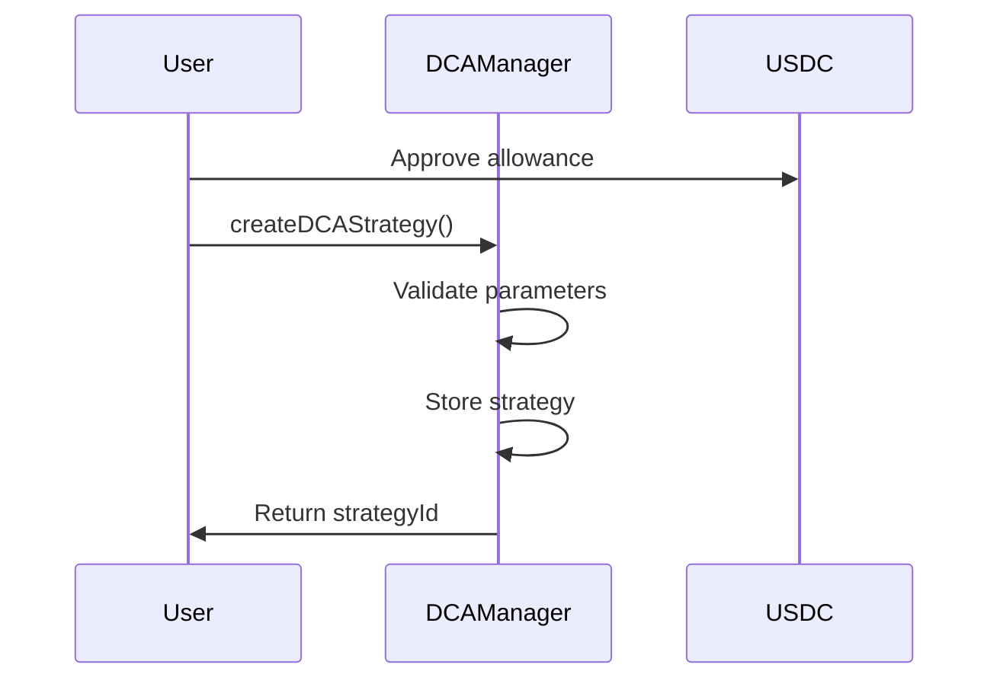
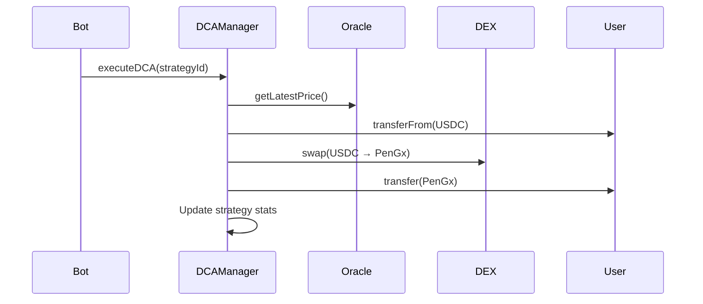

# 💰 PentaGold DCA System - Hệ thống Đầu tư Định kỳ

## 📖 Tổng quan

Hệ thống DCA (Dollar Cost Averaging) của PentaGold cho phép người dùng tự động hóa việc đầu tư vào token PenGx một cách thông minh và hiệu quả. Hệ thống giúp giảm thiểu rủi ro biến động giá và tối ưu hóa lợi nhuận theo thời gian.

## 🏗️ Kiến trúc Hệ thống

### Smart Contracts

1. **DCAManager.sol** - Contract chính quản lý DCA strategies
2. **DCAAutomationBot.sol** - Bot tự động thực hiện DCA
3. **IDCAManager.sol** - Interface định nghĩa các function

### Frontend Integration

1. **DCAService.ts** - Service layer kết nối với smart contracts
2. **DCASection.tsx** - UI component chính
3. **DCAForm.tsx** - Form tạo DCA strategy

## 🚀 Tính năng Chính

### ✨ Cho Người dùng

- **Tạo Chiến lược DCA**: Thiết lập đầu tư định kỳ với tần suất tùy chọn
- **Quản lý Linh hoạt**: Tạm dừng, tiếp tục, hủy bỏ strategy bất kỳ lúc nào
- **Theo dõi Thống kê**: Xem chi tiết lịch sử đầu tư và hiệu suất
- **Tự động hóa Hoàn toàn**: Không cần can thiệp thủ công

### 🔧 Cho Admin

- **Emergency Controls**: Tạm dừng hệ thống trong trường hợp khẩn cấp
- **Fee Management**: Điều chỉnh phí thực hiện và phí nền tảng
- **Token Support**: Thêm/xóa token được hỗ trợ
- **Monitoring**: Theo dõi hoạt động và performance

## 📋 Luồng Hoạt động

### 1. Tạo DCA Strategy



### 2. Thực hiện DCA



## 💻 API Reference

### DCAManager Contract

#### Tạo Strategy
```solidity
function createDCAStrategy(
    address paymentToken,    // USDC address
    address targetToken,     // PenGx address
    uint256 amount,          // Amount per execution
    uint256 frequency,       // Frequency in seconds
    uint256 startTime,       // Start timestamp
    uint256 endTime          // End timestamp (0 for indefinite)
) external returns (uint256 strategyId)
```

#### Quản lý Strategy
```solidity
function pauseDCAStrategy(uint256 strategyId) external
function resumeDCAStrategy(uint256 strategyId) external
function cancelDCAStrategy(uint256 strategyId) external
function updateDCAStrategy(uint256 strategyId, uint256 newAmount, uint256 newFrequency, uint256 newEndTime) external
```

#### View Functions
```solidity
function getDCAStrategy(uint256 strategyId) external view returns (DCAStrategy memory)
function getUserStrategies(address user) external view returns (uint256[] memory)
function getStrategyStats(uint256 strategyId) external view returns (...)
function isExecutable(uint256 strategyId) external view returns (bool)
```

### Frontend Service

#### Tạo DCA Service
```typescript
import { createDCAService } from './services/dcaService';

const dcaService = createDCAService(signer);
```

#### Tạo Strategy
```typescript
const result = await dcaService.createDCAStrategy({
  amount: 100,              // $100 USD
  frequency: 'weekly',      // weekly/daily/monthly
  startDate: '2024-01-01',
  endDate: '2024-12-31'     // optional
});
```

#### Quản lý Strategy
```typescript
await dcaService.pauseStrategy(strategyId);
await dcaService.resumeStrategy(strategyId);
await dcaService.cancelStrategy(strategyId);
```

## 🔧 Cài đặt và Deploy

### 1. Install Dependencies

```bash
npm install @openzeppelin/contracts-upgradeable
npm install @chainlink/contracts
```

### 2. Compile Contracts

```bash
npx hardhat compile
```

### 3. Deploy

```bash
# Testnet
npx hardhat run scripts/deploy-dca.js --network sepolia

# Mainnet
npx hardhat run scripts/deploy-dca.js --network mainnet
```

### 4. Verify Contracts

```bash
npx hardhat verify --network sepolia DEPLOYED_ADDRESS
```

## 🧪 Testing

### Run Tests

```bash
npx hardhat test test/DCAManager.test.js
```

### Test Coverage

```bash
npx hardhat coverage
```

## 📊 Parameters & Limits

| Parameter | Value | Description |
|-----------|-------|-------------|
| Min Frequency | 1 hour | Tần suất thực hiện tối thiểu |
| Max Frequency | 365 days | Tần suất thực hiện tối đa |
| Min Amount | $1 USDC | Số tiền đầu tư tối thiểu |
| Max Amount | $1M USDC | Số tiền đầu tư tối đa |
| Execution Fee | 1% | Phí thực hiện DCA |
| Platform Fee | 0.5% | Phí nền tảng |
| Max Slippage | 5% | Slippage tối đa cho swap |

## 🔐 Security Features

### Smart Contract Security

- **Access Control**: Role-based permissions
- **Reentrancy Protection**: ReentrancyGuard
- **Pausable**: Emergency pause functionality
- **Upgradeable**: UUPS proxy pattern
- **Circuit Breaker**: Automatic pause on anomalies

### Frontend Security

- **Input Validation**: Comprehensive parameter validation
- **Error Handling**: Graceful error management
- **Rate Limiting**: Prevent spam transactions
- **Wallet Security**: Secure wallet integration

## 📈 Monitoring & Analytics

### Events

```solidity
event DCAStrategyCreated(uint256 indexed strategyId, address indexed user, ...);
event DCAStrategyExecuted(uint256 indexed strategyId, uint256 amountIn, uint256 amountOut, ...);
event DCAStrategyPaused(uint256 indexed strategyId, address indexed user);
event DCAStrategyResumed(uint256 indexed strategyId, address indexed user);
event DCAStrategyCancelled(uint256 indexed strategyId, address indexed user);
```

### Metrics

- Total Value Locked (TVL)
- Number of active strategies
- Total volume traded
- Average execution success rate
- User retention metrics

## 🚨 Emergency Procedures

### Emergency Pause

```solidity
// Activate emergency mode
await dcaManager.activateEmergencyMode();

// Deactivate emergency mode
await dcaManager.deactivateEmergencyMode();
```

### Admin Functions

```solidity
// Update fees
await dcaManager.setFees(newExecutionFee, newPlatformFee);

// Add supported token
await dcaManager.setSupportedToken(tokenAddress, true);

// Update automation bot settings
await automationBot.setBatchSize(newBatchSize);
```

## 📞 Support & Documentation

### Resources

- [Smart Contract Documentation](./docs/contracts.md)
- [API Documentation](./docs/api.md)
- [Frontend Integration Guide](./docs/frontend.md)
- [Security Audit Report](./docs/audit.md)

### Contact

- **Team**: PentaGold Development Team
- **Email**: dev@pentagold.io
- **Discord**: [PentaGold Community](https://discord.gg/pentagold)
- **GitHub**: [PentaGold Repository](https://github.com/pentagold/dca-system)

## 📄 License

MIT License - see [LICENSE](./LICENSE) file for details.

---

**⚠️ Disclaimer**: Đây là phần mềm thí nghiệm. Vui lòng kiểm tra kỹ lưỡng trước khi sử dụng với số tiền lớn. Nhóm phát triển không chịu trách nhiệm về các tổn thất có thể xảy ra.
